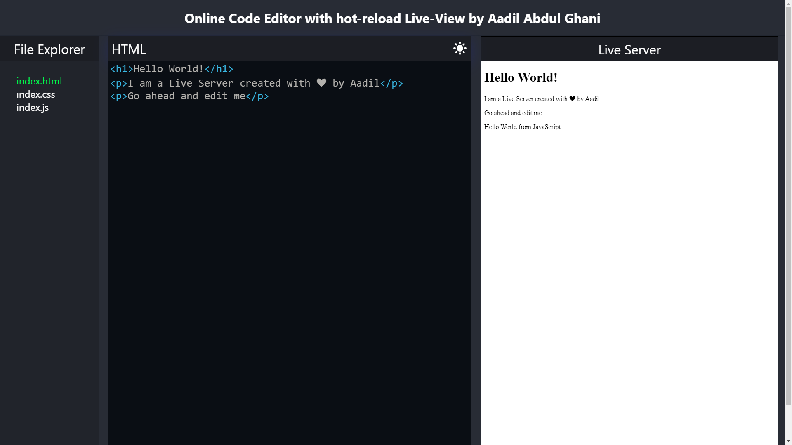

# Online Code Editor by Aadil Abdul Ghani

This project is deployed. Click the link to see it live ->> [Online Code Editor](https://aadilghani1.github.io/online-code-editor/).

## Directions to install

Clone or Download zip by clicking the top green button named Code.

### `npm install --force`

run the above command in a terminal within the project directory.

### `npm start`

Run the above command after installing the required packages it will start a development server.

### Extra feature added by me: `Dark Mode Toggle in Code Editor`

### Is there an other way round rather than installing packages or checking through deployed link?

Yes, I have a 5min video that explains it all ->> [5min Demonstration Video](https://www.loom.com/share/712b7d13d0b4418f8db7df0828044f6b)

